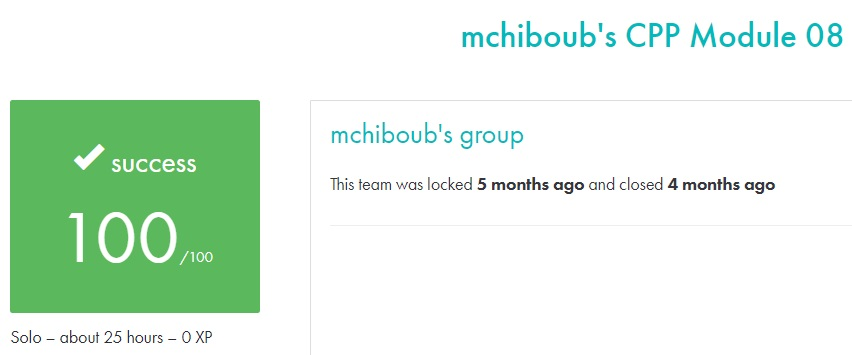

# C++ module 08 #

## What the project does: ##
The C++ - Module 08 project focuses on templated containers, iterators, and algorithms using the Standard Template Library (STL). It includes exercises like finding elements in containers, calculating the shortest and longest spans in a list of integers, and creating an iterable version of the std::stack container.

## Why the project is useful: ##
This project is useful because it teaches you how to effectively use C++'s STL containers, iterators, and algorithms, which are essential tools for efficient data manipulation. Mastering these concepts enables you to write flexible, reusable, and efficient code when dealing with collections of data in real-world applications.

[Subject of this project](en.subject.pdf)